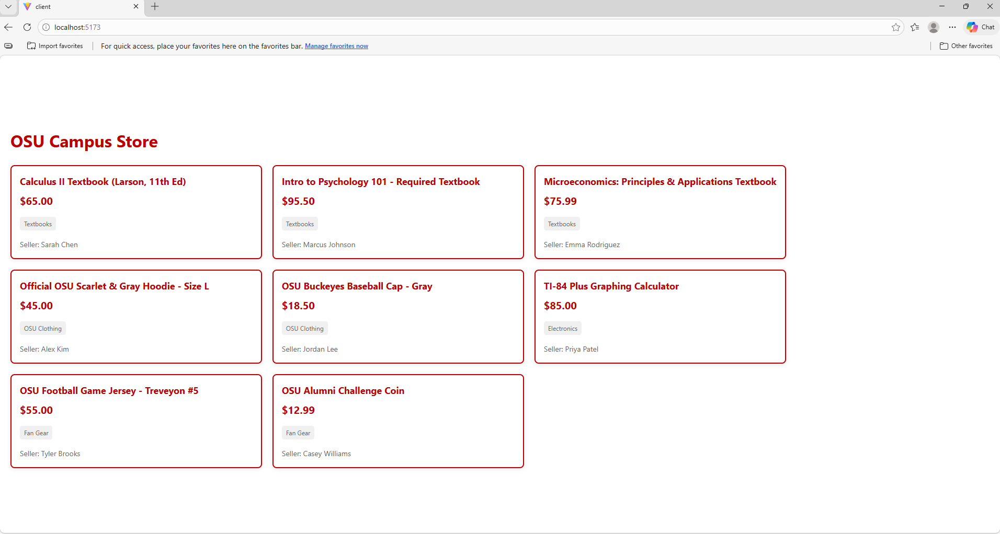
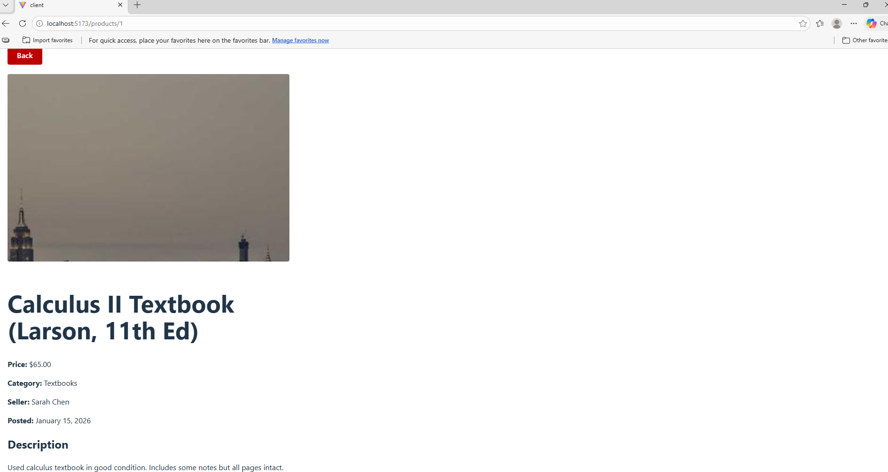

# Bus-Sys-App-Dev-Project
ACCTMIS 4630 - Bus Sys App Dev Project. OSU eCommerce Platform

## Business System Summary

The OSU Campus Store eCommerce Platform is a web-based system designed to streamline textbook purchasing for Ohio State students, faculty, and fans. The platform addresses key pain points: students struggle to find course-specific textbooks across multiple platforms, faculty lack visibility into adoption status and inventory, and all users need a unified shopping experience.

**Target Users:**
- **Students** (Primary): Need quick access to required textbooks with price comparison
- **Faculty**: Need to submit textbook adoptions and verify stock availability  
- **Fans**: Need easy access to official OSU merchandise

**Core Value Proposition:** Course-based auto-population eliminates manual textbook searching by automatically displaying required books based on enrolled courses.

---

## How to Run Locally

### Prerequisites
- Node.js 18+
- .NET 10 SDK

### Run the Backend API
```bash
cd BuckeyeMarketplace.API
dotnet run --launch-profile https
```
API will be available at `http://localhost:5000`

### Run the Frontend
```bash
cd client
npm install
npm run dev
```
React app will be available at `http://localhost:5173`

> **Note:** Both must be running simultaneously for the app to work.

---

## Screenshots

### Product List Page


### Product Detail Page


---

## Feature Prioritization

### Must-Have Features (P1) - 9 Total
1. User Registration & Login
2. Product Catalog
3. Shopping Cart
4. Course-Based Auto-Population
5. Unified Price Comparison View
6. Faculty Textbook Adoption Portal
7. Adoption-to-Availability Confirmation
8. Role-Based Homepage & Navigation
9. Cloud Deployment

### Top User Stories
- **US1**: Course-Based Auto-Population - Students see required textbooks automatically
- **US2**: Unified Price Comparison - All pricing options on one page
- **US3**: Faculty Adoption Portal - Professors submit adoptions with stock visibility
- **US4**: Shopping Cart - Persistent cart across sessions
- **US5**: Role-Based Homepage - Dashboard adapts to user role

---

## Architecture Decisions

### Technology Stack
| Layer | Technology | Rationale |
|-------|-----------|-----------|
| **Frontend** | React + TypeScript | Component reusability, industry standard, type safety |
| **Backend** | ASP.NET Core (.NET 10) | Enterprise-grade, Azure integration, strong typing |
| **Database** | Azure SQL Database | Relational queries, ACID compliance, managed service |
| **Hosting** | Azure App Service | Student credits, .NET optimization, PaaS simplicity |
| **Version Control** | GitHub + Actions | Industry standard, CI/CD automation, portfolio value |

### Key Architectural Patterns
- **3-Tier Architecture**: React (Presentation) → ASP.NET Core API (Business Logic) → Azure SQL (Data)
- **RESTful API**: Clean separation between frontend and backend
- **JWT Authentication**: Stateless, role-based access control
- **Atomic Design**: Component hierarchy for frontend (Atoms → Molecules → Organisms → Templates)

---

## Documentation

### Table of Contents
- [Systems Architecture Diagram](docs/System-Architecture-Diagram.md) - 3-layer architecture overview
- [Entity Relationship Diagram (ERD)](docs/Entity-Relationship-Diagram.md) - Database schema and relationships
- [Architecture Decision Records](docs/Architecture-Decision-Records.md) - Technology stack justifications
- [Project Kanban Board](https://github.com/users/Jackson-Ware/projects/1) - Feature prioritization and task tracking
- [Component Architecture](docs/Component-Architecture.md) - Frontend component hierarchy (Atomic Design)
- [AI Usage Documentation](docs/AI-Usage-Documentation.md) - Transparency on AI tool usage

---

## AI Usage

**Milestone 2**

**Tool:** Claude (Anthropic) - Sonnet 4.5  
**Purpose:** Documentation structure, concept explanations, markdown formatting  
**Disclosure:** All AI-generated content was reviewed, validated, edited, and customized by the student. All architectural decisions and technology choices are my own. See [AI Usage Documentation](docs/AI-Usage-Documentation.md) for full details.

**Milestone 3**

**Tools Used:** GitHub Copilot, Claude (Anthropic)

| What | Prompt Used | Accepted/Modified |
|------|-------------|-------------------|
| Product.cs model | "Create a Product.cs model class with fields: id, title, description, price, category, sellerName, postedDate, imageUrl" | Accepted as-is |
| ProductsController | "Create a ProductsController with GET /api/products and GET /api/products/{id} with 404 handling and 8 OSU products" | Accepted as-is |
| ProductCard.tsx | "Create a ProductCard component with OSU scarlet/gray styling and useNavigate" | Modified import type syntax |
| ProductList.tsx | "Create a ProductList that fetches from API with loading/empty states" | Modified import type syntax |
| ProductDetail.tsx | "Create a ProductDetail using useParams to fetch single product" | Modified import type syntax |
| App.tsx routing | "Set up React Router with routes for / and /products/:id" | Accepted as-is |

**My own decisions:**
- Chose OSU-themed product data (textbooks, clothing, fan gear) to match personas

**Issues I fixed myself:**
- Copilot consistently generated `import { Product }` instead of 
  `import type { Product }` — fixed manually in all three component files
- Disabled HTTPS redirection in Program.cs to fix localhost redirect loop
- Added port 5174 to CORS config when Vite switched ports
---

## Project Status

**Current Milestone:** Milestone 3 - Product Catalog (Vertical Slice 1)
**Completion Date:** March 6, 2026  
**Course:** ACCTMIS 4630 - Business Systems Development

---

## Contact

**Student:** Jackson Ware  
**Email:** ware.450@osu.edu  
**Course:** ACCTMIS 4630  
**Semester:** Spring 2026
