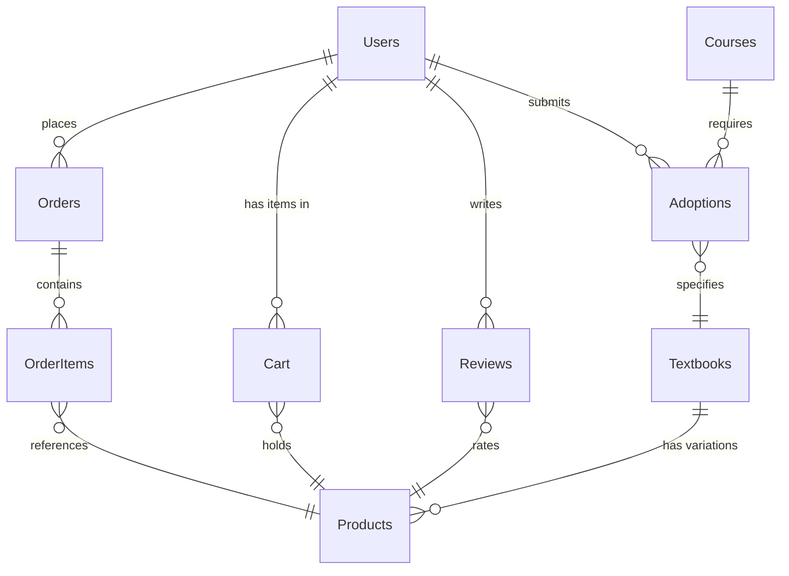

# Entity Relationship Diagram

This diagram shows the 9 core tables and their relationships. One-to-many relationships (1:N) are indicated by ||--o{ notation, meaning one parent record relates to multiple child records (e.g., Users to Orders). Many-to-many relationships use junction tables: Adoptions connects Courses to Textbooks, and Cart links Users to Products.
The schema supports course-based auto-population (US1) by connecting Users → Courses → Adoptions → Textbooks → Products, allowing students to see required books automatically. It also enables price comparison (US2) where one Textbook can have multiple Product variations for different conditions (new/used/rental), and supports the complete shopping flow (US4) through Cart, Orders, and OrderItems tables.
