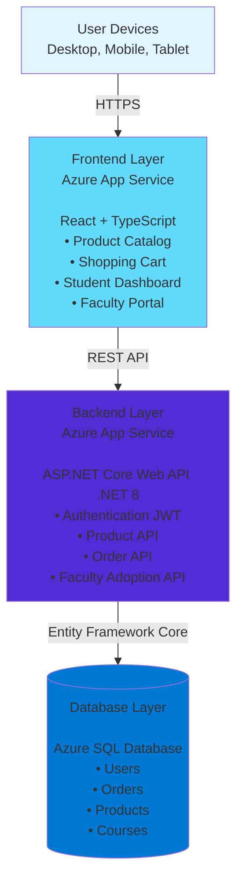

# System Architecture Diagram

## Architecture Connection to User Needs

**Frontend (React):**
- Marcus needs fast, mobile-friendly browsing for textbooks
- Lisa needs an organized merch catalog
- Dr. Okafor needs a faculty adoption portal interface

**Backend (.NET API):**
- Handles all business logic (authentication, orders, adoptions)
- Connects to LMS API for Marcus's auto-populated "My Books"
- Manages faculty adoption workflow for Dr. Okafor

**Database (Azure SQL):**
- Stores all user data, products, orders, and course adoptions
- Relational structure supports complex queries (linking courses to textbooks)
- Entity Framework Core provides type-safe database access
